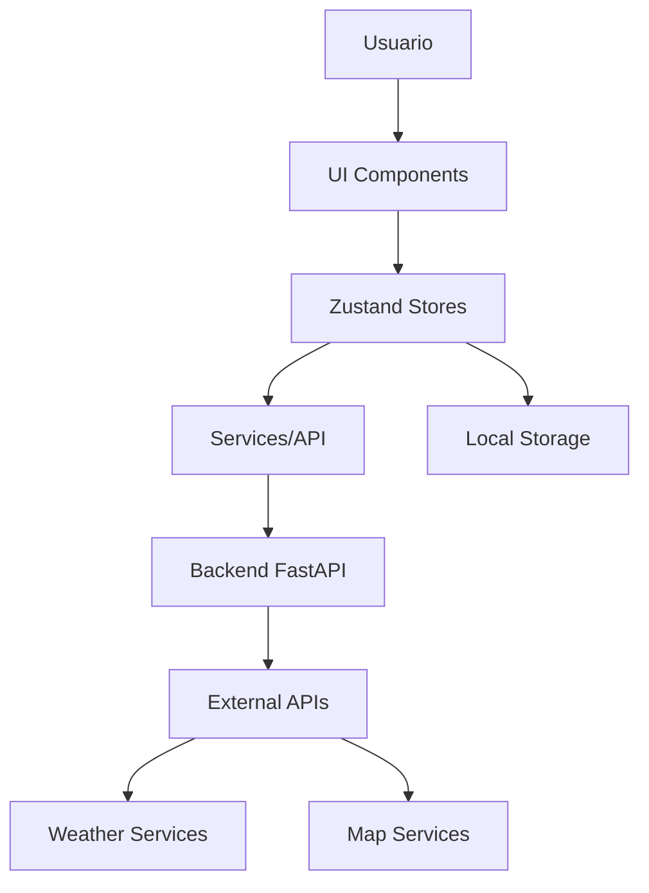

# RainRoute Web

Aplicación web de predicción de lluvia en rutas para ayudar a los usuarios a tomar decisiones informadas sobre sus desplazamientos diarios.

## 🌟 Overview

RainRoute Web es una aplicación que permite a los usuarios conocer si está lloviendo en su ruta habitual o si la lluvia se desplazará hacia su ruta en los próximos minutos, utilizando datos meteorológicos, información de viento y un sistema de predicción progresivo.

## 🚀 Características Principales

- **📍 Gestión de Rutas**: Define tus rutas habituales (casa ↔ trabajo)
- **🌤️ Monitoreo Climático**: Datos en tiempo real de lluvia y viento
- **⚡ Predicción Inteligente**: Sistema que combina reglas determinísticas con IA
- **🚨 Alertas Personalizadas**: Notificaciones claras y accionables
- **🗺️ Mapas Interactivos**: Visualización detallada de rutas y condiciones climáticas

## 🛠️ Stack Tecnológico

- **Frontend**: Next.js 16, React 18, TypeScript
- **Estilos**: Tailwind CSS
- **Estado**: Zustand
- **Mapas**: Mapbox GL JS
- **HTTP**: Axios con React Query
- **Formularios**: React Hook Form + Zod
- **Backend**: FastAPI (proyecto separado)

## 📁 Estructura del Proyecto

```
rainRouteWeb/
├── docs/                          # Documentación
│   ├── setup_plan.md             # Plan de configuración
│   ├── architecture.md           # Arquitectura detallada
│   └── api_reference.md         # Referencia de APIs
├── app/                           # App Router de Next.js
│   ├── (auth)/                   # Rutas de autenticación
│   ├── dashboard/                # Dashboard principal
│   ├── routes/                   # Gestión de rutas
│   └── alerts/                   # Alertas y notificaciones
├── features/                      # Funcionalidades (Vertical Slices)
│   ├── auth/                     # Autenticación
│   ├── map/                      # Mapas
│   ├── weather/                  # Clima
│   └── alerts/                   # Alertas
├── ui/                            # Componentes UI (Shared)
│   ├── button.tsx
│   └── input.tsx
├── hooks/                         # Hooks personalizados
├── store/                         # Zustand stores
├── services/                      # Servicios de API
├── types/                         # Definiciones TypeScript
├── utils/                         # Utilidades
├── lib/                           # Configuraciones
├── public/                        # Archivos estáticos
└── Config files                 # Next.js, TypeScript, Tailwind, etc.
```

## 🚦 Requerimientos Funcionales (MVP)

### Esenciales (Prioridad 1)

- ✅ Registro e inicio de sesión de usuarios
- ✅ Definición de rutas (puntos A y B)
- ✅ Configuración de horarios de desplazamiento
- ✅ Visualización de rutas en mapa interactivo
- ✅ Consulta de datos climáticos
- ✅ Generación de alertas de riesgo
- ✅ Recomendaciones claras para el usuario

### Mejoras (Prioridad 2)

- 🔄 Análisis avanzado de desplazamiento de lluvia
- 🔄 Clasificación de riesgo (bajo/medio/alto)
- 🔄 Historial de alertas
- 🔄 Roles de usuario

## 🏗️ Arquitectura

### Flujo de Datos



### Principios de Diseño

- **Minimalista**: Interfaz limpia y sin distracciones
- **Accesible**: Cumplimiento de WCAG 2.1 AA
- **Responsive**: Funciona en móviles y desktop
- **Rápida**: Optimización para cargas rápidas

## 🚀 Quick Start

### Prerrequisitos

- Node.js 18+
- npm o yarn
- Cuenta de Mapbox (para mapas)

### Instalación

1. **Clonar el repositorio**

   ```bash
   git clone https://github.com/TefaSalcedo/rainroute-web.git
   cd rainroute-web
   ```

2. **Instalar dependencias**

   ```bash
   npm install
   ```

3. **Configurar variables de entorno**

   ```bash
   cp .env.example .env.local
   ```

   Editar `.env.local` con tus tokens:

   ```env
   NEXT_PUBLIC_MAPBOX_TOKEN=your_mapbox_token
   NEXT_PUBLIC_API_URL=http://localhost:8000
   OPENWEATHER_API_KEY=your_openweather_key
   ```

4. **Iniciar desarrollo**

   ```bash
   npm run dev
   ```

5. **Abrir [http://localhost:3000](http://localhost:3000)**

## 📋 Scripts Disponibles

```bash
npm run dev          # Servidor de desarrollo
npm run build        # Build para producción
npm run start        # Servidor de producción
npm run lint         # ESLint
npm run type-check   # Verificación de tipos
npm run format       # Formatear código con Biome
npm run test         # Ejecutar tests
```

## 🔧 Configuración

### Variables de Entorno

```env
# API Configuration
NEXT_PUBLIC_API_URL=http://localhost:8000
NEXT_PUBLIC_MAPBOX_TOKEN=your_mapbox_token

# Auth
NEXTAUTH_SECRET=your_secret_key
NEXTAUTH_URL=http://localhost:3000

# External APIs
OPENWEATHER_API_KEY=your_openweather_key
```

### Configuración de Mapas

1. Crear cuenta en [Mapbox](https://mapbox.com)
2. Obtener token de acceso
3. Configurar en `.env.local`

## 🧪 Testing

El proyecto utiliza una estrategia de testing multicapa:

- **Unit Tests**: Jest + React Testing Library
- **Integration Tests**: Pruebas de componentes completos
- **E2E Tests**: Playwright para flujos críticos

```bash
npm run test              # Todos los tests
npm run test:unit         # Unit tests
npm run test:e2e          # E2E tests
npm run test:coverage     # Coverage report
```

## 🚀 Despliegue

### Vercel (Recomendado)

1. Conectar repositorio a Vercel
2. Configurar variables de entorno
3. Deploy automático en cada push a `main`

### Otros proveedores

El proyecto está configurado para funcionar en cualquier plataforma que soporte Next.js:

- Netlify
- AWS Amplify
- Railway
- DigitalOcean App Platform

## 📊 Métricas y Monitoreo

### Performance Targets

- **Lighthouse Score**: > 90
- **Bundle Size**: < 500KB gzipped
- **Time to Interactive**: < 3s en 3G
- **First Contentful Paint**: < 1.5s

### Monitoreo

- Analytics para métricas de usuario
- Error tracking para producción
- Performance monitoring

## 🤝 Contribución

### Flujo de Trabajo

1. **Fork** el repositorio
2. Crear **branch** de feature: `git checkout -b feature/amazing-feature`
3. **Commit** cambios: `git commit -m 'feat: add amazing feature'`
4. **Push** al branch: `git push origin feature/amazing-feature`
5. Abrir **Pull Request**

### Convención de Commits

- `feat:` Nuevas features
- `fix:` Bug fixes
- `docs:` Documentación
- `style:` Formato/código style
- `refactor:` Refactoring
- `test:` Tests
- `chore:` Tareas de mantenimiento

## 📝 Licencia

Este proyecto está licenciado bajo la MIT License - ver el archivo [LICENSE](LICENSE) para detalles.

## 🙏 Agradecimientos

- **Mapbox** Por los increíbles mapas y herramientas de geolocalización
- **OpenWeatherMap** Por los datos climáticos
- **Next.js Team** Por el excelente framework
- **Tailwind CSS** Por el sistema de diseño utilitario

## 📞 Contacto

- **Proyecto**: [RainRoute Web](https://github.com/TefaSalcedo/rainroute-web)
- **Issues**: [GitHub Issues](https://github.com/TefaSalcedo/rainroute-web/issues)
- **Discusiones**: [GitHub Discussions](https://github.com/TefaSalcedo/rainroute-web/discussions)

---

## 🗺️ Roadmap

### v1.0 - MVP (Q1 2025)

- ✅ Autenticación completa
- ✅ Gestión básica de rutas
- ✅ Integración con APIs de clima
- ✅ Sistema de alertas simple

### v1.1 - Mejoras (Q2 2025)

- 🔄 Motor de predicción avanzado
- 🔄 Notificaciones push
- 🔄 Optimización de rendimiento

### v2.0 - IA Avanzada (Q3 2025)

- 📋 Integración con modelos de IA
- 📋 Predicciones probabilísticas
- 📋 Análisis histórico

---

_Desarrollado con ❤️ por [TefaSalcedo](https://github.com/TefaSalcedo)_
