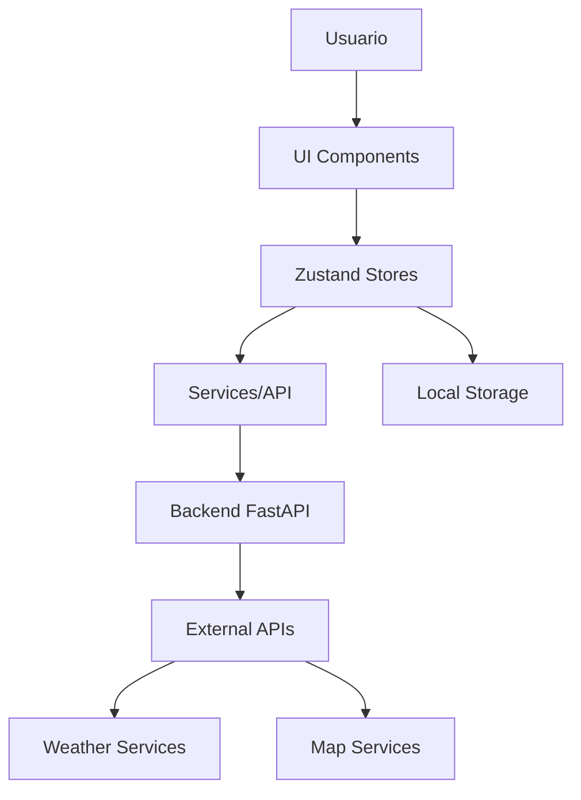

# Plan de Configuración Inicial - RainRoute Web

## Resumen Ejecutivo

Este documento describe el plan completo para inicializar el proyecto **RainRoute Web** utilizando Next.js 16, TypeScript, Tailwind CSS y Zustand, siguiendo los requerimientos definidos en el documento de requisitos del proyecto.

---

## 1. Objetivos del Plan

- ✅ Inicializar repositorio Git local
- ✅ Configurar estructura de proyecto Next.js 16 + TypeScript
- ✅ Integrar Tailwind CSS para estilos
- ✅ Configurar Zustand para manejo de estado
- ✅ Conectar con repositorio GitHub remoto
- ✅ Documentar arquitectura y estructura
- ✅ Realizar primer commit con configuración base

---

## 2. Arquitectura Propuesta

### 2.1 Estructura de Carpetas

```
rainRouteWeb/
├── docs/                          # Documentación del proyecto
│   ├── setup_plan.md             # Este documento
│   ├── architecture.md           # Arquitectura detallada
│   ├── api_reference.md         # Referencia de APIs
│   └── deployment.md             # Guía de despliegue
├── app/                           # App Router de Next.js 13+
│   ├── (auth)/                   # Grupo de rutas de autenticación
│   │   ├── login/
│   │   └── register/
│   ├── dashboard/                # Dashboard principal
│   ├── routes/                   # Gestión de rutas
│   ├── alerts/                   # Alertas y notificaciones
│   ├── globals.css               # Estilos globales
│   ├── layout.tsx                # Layout principal
│   └── page.tsx                  # Página principal
├── features/                      # Funcionalidades específicas (Vertical Slices)
│   ├── auth/                     # Auth feature
│   ├── map/                      # Map feature
│   ├── weather/                  # Weather feature
│   └── alerts/                   # Alerts feature
├── ui/                            # Componentes UI reutilizables (Shared)
│   ├── button.tsx
│   ├── input.tsx
│   ├── card.tsx
│   └── index.ts
├── hooks/                         # Hooks personalizados globales
│   ├── useAuth.ts
│   ├── useWeather.ts
│   └── useRoutes.ts
├── store/                         # Zustand stores globales
│   ├── authStore.ts
│   ├── weatherStore.ts
│   ├── routesStore.ts
│   └── index.ts
├── services/                      # Servicios de API globales
│   ├── api.ts                    # Configuración base de API
│   ├── auth.ts
│   ├── weather.ts
│   └── routes.ts
├── types/                         # Definiciones TypeScript globales
│   ├── auth.ts
│   ├── weather.ts
│   ├── routes.ts
│   └── api.ts
├── utils/                         # Utilidades globales
│   ├── constants.ts
│   ├── helpers.ts
│   └── validations.ts
├── lib/                           # Configuraciones de librerías
│   ├── axios.ts                  # Configuración de Axios
│   ├── map.ts                    # Configuración de mapas
├── public/                        # Archivos estáticos
│   ├── icons/
│   ├── images/
│   └── favicon.ico
├── .env.example                 # Variables de entorno ejemplo
├── .gitignore                   # Archivos ignorados por Git
├── README.md                    # Documentación principal
├── package.json                 # Dependencias y scripts
├── next.config.js              # Configuración de Next.js
├── tailwind.config.js          # Configuración de Tailwind
├── tsconfig.json               # Configuración de TypeScript
├── eslint.config.mjs           # Configuración de ESLint
└── biome.json                  # Configuración de Biome (formateo)
```

### 2.2 Flujo de Datos



---

## 3. Tecnologías y Versiones

### 3.1 Core Dependencies

- **Next.js**: 16.0.0 (última estable)
- **React**: 18.3.1
- **TypeScript**: 5.6.3
- **Tailwind CSS**: 3.4.0
- **Zustand**: 5.0.0

### 3.2 Desarrollo

- **ESLint**: 9.15.0
- **Prettier**: 3.3.3
- **Biome**: 1.9.4 (formateo y linting rápido)
- **TypeScript**: para tipado estricto

### 3.3 Servicios y APIs

- **Axios**: 1.7.7 (para llamadas HTTP)
- **React Hook Form**: 7.53.2 (formularios)
- **Zod**: 3.23.8 (validación de schemas)
- **React Query**: 5.59.20 (caching de datos)

### 3.4 Mapas y Geolocalización

- **Mapbox GL JS**: 3.8.0 (mapas interactivos)
- **React Mapbox**: O Leaflet como alternativa

---

## 4. Configuración Paso a Paso

### 4.1 Inicialización Git

```bash
git init
git add README.md
git commit -m "first commit"
git branch -M main
git remote add origin https://github.com/TefaSalcedo/rainroute-web.git
```

### 4.2 Configuración Package.json

Dependencias principales y scripts de desarrollo:

```json
{
  "name": "rainroute-web",
  "version": "0.1.0",
  "private": true,
  "scripts": {
    "dev": "next dev",
    "build": "next build",
    "start": "next start",
    "lint": "next lint",
    "type-check": "tsc --noEmit",
    "format": "biome format --write .",
    "format:check": "biome format .",
    "prepare": "husky install"
  },
  "dependencies": {
    "next": "16.0.0",
    "react": "18.3.1",
    "react-dom": "18.3.1",
    "typescript": "5.6.3",
    "tailwindcss": "3.4.0",
    "zustand": "5.0.0",
    "axios": "1.7.7",
    "react-hook-form": "7.53.2",
    "zod": "3.23.8",
    "@tanstack/react-query": "5.59.20",
    "mapbox-gl": "3.8.0",
    "react-map-gl": "7.1.7"
  },
  "devDependencies": {
    "@types/node": "22.9.0",
    "@types/react": "18.3.12",
    "@types/react-dom": "18.3.1",
    "eslint": "9.15.0",
    "eslint-config-next": "16.0.0",
    "postcss": "8.4.47",
    "autoprefixer": "10.4.20",
    "@biomejs/biome": "1.9.4",
    "husky": "9.1.6",
    "lint-staged": "15.2.10"
  }
}
```

### 4.3 Archivos de Configuración

#### Next.js Config

```javascript
/** @type {import('next').NextConfig} */
const nextConfig = {
  experimental: {
    appDir: true,
  },
  images: {
    domains: ["api.mapbox.com", "tiles.mapbox.com"],
  },
  env: {
    NEXT_PUBLIC_MAPBOX_TOKEN: process.env.NEXT_PUBLIC_MAPBOX_TOKEN,
  },
};

module.exports = nextConfig;
```

#### TypeScript Config

```json
{
  "compilerOptions": {
    "target": "es5",
    "lib": ["dom", "dom.iterable", "es6"],
    "allowJs": true,
    "skipLibCheck": true,
    "strict": true,
    "noEmit": true,
    "esModuleInterop": true,
    "module": "esnext",
    "moduleResolution": "bundler",
    "resolveJsonModule": true,
    "isolatedModules": true,
    "jsx": "preserve",
    "incremental": true,
    "plugins": [
      {
        "name": "next"
      }
    ],
    "baseUrl": ".",
    "paths": {
      "@app/*": ["./app/*"],
      "@features/*": ["./features/*"],
      "@ui/*": ["./ui/*"],
      "@hooks/*": ["./hooks/*"],
      "@store/*": ["./store/*"],
      "@services/*": ["./services/*"],
      "@types/*": ["./types/*"],
      "@utils/*": ["./utils/*"],
      "@lib/*": ["./lib/*"]
    }
  },
  "include": ["next-env.d.ts", "**/*.ts", "**/*.tsx", ".next/types/**/*.ts"],
  "exclude": ["node_modules"]
}
```

#### Tailwind Config

```javascript
/** @type {import('tailwindcss').Config} */
module.exports = {
  content: [
    "./app/**/*.{js,ts,jsx,tsx,mdx}",
    "./features/**/*.{js,ts,jsx,tsx,mdx}",
    "./ui/**/*.{js,ts,jsx,tsx,mdx}",
  ],
  theme: {
    extend: {
      colors: {
        primary: {
          50: "#eff6ff",
          500: "#3b82f6",
          600: "#2563eb",
          700: "#1d4ed8",
        },
        weather: {
          rain: "#6b7280",
          sun: "#fbbf24",
          cloud: "#9ca3af",
        },
      },
      fontFamily: {
        sans: ["Inter", "sans-serif"],
      },
    },
  },
  plugins: [],
};
```

---

## 5. Implementación de Features Principales

### 5.1 Autenticación (RF-01 a RF-05)

- **Registro de usuarios**: Formulario con email y contraseña
- **Login**: Autenticación con JWT
- **Verificación de email**: Envío de correo de confirmación
- **Recuperación de contraseña**: Flujo de reset por email

### 5.2 Gestión de Rutas (RF-06 a RF-08)

- **Definición de puntos A y B**: Selector de ubicaciones en mapa
- **Configuración de horarios**: Dos horarios por ruta
- **Visualización de rutas**: Mapa interactivo con la ruta dibujada

### 5.3 Sistema de Clima y Alertas (RF-09 a RF-12)

- **Integración con APIs de clima**: OpenWeatherMap o Tomorrow.io
- **Análisis de lluvia en ruta**: Consulta por puntos de la ruta
- **Generación de alertas**: Sistema de notificaciones
- **Recomendaciones claras**: "Sal ahora", "Espera X minutos"

---

## 6. Consideraciones de Diseño

### 6.1 Principios UI/UX

- **Minimalista**: Interfaz limpia y sin distracciones
- **Accesible**: Cumplimiento de WCAG 2.1 AA
- **Responsive**: Funciona en móviles y desktop
- **Rápida**: Optimización para cargas rápidas

### 6.2 Sistema de Diseño

- **Colores**: Azules para clima, grises para lluvia, amarillos para alertas
- **Tipografía**: Inter como fuente principal
- **Componentes**: Sistema de diseño consistente con Tailwind
- **Iconos**: Heroicons o Lucide React

---

## 7. Integración con Backend

### 7.1 Conexión con FastAPI

- **Base URL**: Configurable por entorno
- **Autenticación**: Bearer token en headers
- **Manejo de errores**: Estandarizado con try/catch
- **Caching**: React Query para optimización

### 7.2 APIs Externas

- **Mapbox**: Para visualización de mapas y geocoding
- **OpenWeatherMap**: Para datos de clima
- **Tomorrow.io**: Como alternativa para clima más preciso

---

## 8. Testing y Calidad

### 8.1 Estrategia de Testing

- **Unit Tests**: Jest + React Testing Library
- **Integration Tests**: Pruebas de componentes completos
- **E2E Tests**: Playwright para flujos críticos
- **Type Checking**: TypeScript estricto

### 8.2 Calidad de Código

- **ESLint**: Reglas estrictas de código
- **Prettier**: Formateo consistente
- **Husky**: Pre-commit hooks
- **Lint-staged**: Validación en archivos staged

---

## 9. Despliegue

### 9.1 Entornos

- **Development**: Local con `npm run dev`
- **Staging**: Vercel Preview Deployments
- **Production**: Vercel con dominio personalizado

### 9.2 Variables de Entorno

```env
# API Configuration
NEXT_PUBLIC_API_URL=http://localhost:8000
NEXT_PUBLIC_MAPBOX_TOKEN=your_mapbox_token

# Auth
NEXTAUTH_SECRET=your_secret_key
NEXTAUTH_URL=http://localhost:3000

# External APIs
OPENWEATHER_API_KEY=your_openweather_key
```

---

## 10. Próximos Pasos

### 10.1 Inmediatos (Sprint 1)

1. ✅ Configuración inicial del proyecto
2. ✅ Estructura base de carpetas
3. 🔄 Componentes UI básicos
4. 🔄 Configuración de autenticación
5. 🔄 Integración con mapa básico

### 10.2 Corto Plazo (Sprint 2-3)

1. 📋 Implementación completa de autenticación
2. 📋 Gestión de rutas funcional
3. 📋 Integración con APIs de clima
4. 📋 Sistema de alertas básico

### 10.3 Mediano Plazo (Sprint 4-6)

1. 📋 Motor de predicción avanzado
2. 📋 Sistema de notificaciones push
3. 📋 Optimización de rendimiento
4. 📋 Testing completo

---

## 11. Riesgos y Mitigación

### 11.1 Riesgos Técnicos

- **Dependencia de APIs externas**: Implementar fallbacks y caché
- **Rendimiento en mapas**: Optimizar carga de tiles y datos
- **Complejidad de estado**: Mantener stores de Zustand simples

### 11.2 Riesgos de Proyecto

- **Scope creep**: Mantenerse enfocado en MVP
- **Integración con backend**: Coordinación estrecha con equipo backend
- **Calidad de datos climáticos**: Validar precisión de predicciones

---

## 12. Métricas de Éxito

### 12.1 Técnicas

- **Performance**: Lighthouse score > 90
- **Bundle Size**: < 500KB gzipped
- **TTI**: < 3 segundos en 3G
- **Coverage**: > 80% de código testeado

### 12.2 de Usuario

- **Tiempo de carga**: < 2 segundos
- **Tasa de error**: < 1%
- **Satisfacción**: Feedback positivo de usuarios beta

---

## 13. Checklist de Implementación

- [ ] Inicializar Git y conectar con GitHub
- [ ] Crear estructura de carpetas
- [ ] Configurar package.json
- [ ] Configurar TypeScript
- [ ] Configurar Tailwind CSS
- [ ] Configurar ESLint y Prettier
- [ ] Crear componentes UI base
- [ ] Configurar Zustand stores
- [ ] Implementar autenticación
- [ ] Integrar mapas
- [ ] Conectar con APIs de clima
- [ ] Crear documentación
- [ ] Configurar testing
- [ ] Primer deploy a staging

---

## 14. Comunicación y Colaboración

### 14.1 Flujo de Trabajo

1. **Branches**: `main`, `develop`, `feature/*`, `hotfix/*`
2. **Commits**: Convención de commits semánticos
3. **PRs**: Revisión por pares requerida
4. **Releases**: Semánticos con CHANGELOG

### 14.2 Documentación

- **README**: Información general y quick start
- **docs/**: Documentación detallada
- **Code Comments**: Código auto-documentado
- **API Docs**: Referencia de endpoints

---

## 15. Conclusión

Este plan establece una base sólida para el desarrollo de RainRoute Web, siguiendo las mejores prácticas de desarrollo moderno y asegurando la escalabilidad y mantenibilidad del proyecto. La arquitectura propuesta soporta los requerimientos definidos y permite una evolución progresiva hacia features más avanzados como la integración con IA.

La implementación se realizará de manera iterativa, priorizando el MVP y agregando funcionalidades de forma incremental basada en el feedback de usuarios y las necesidades del negocio.

---

_Última actualización: Diciembre 2025_
_Versión: 1.0.0_
